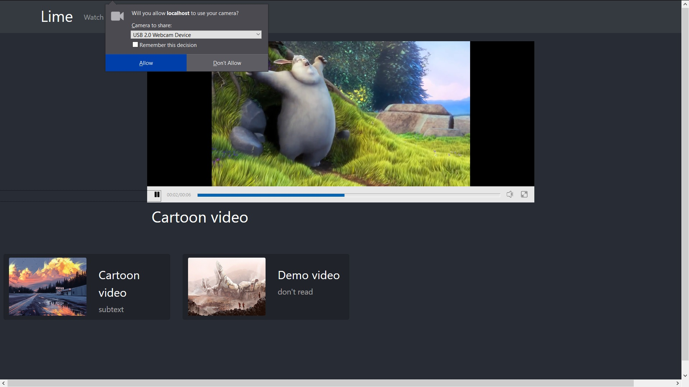
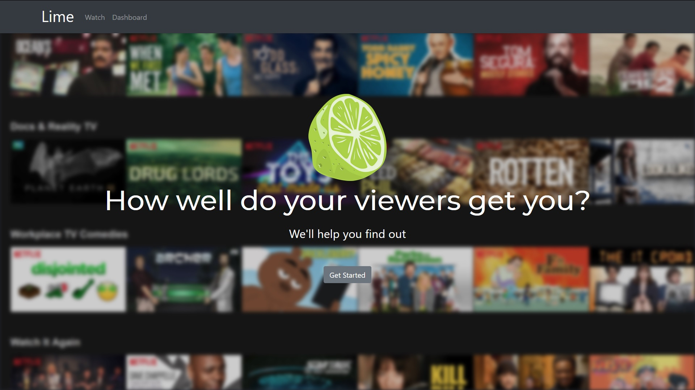
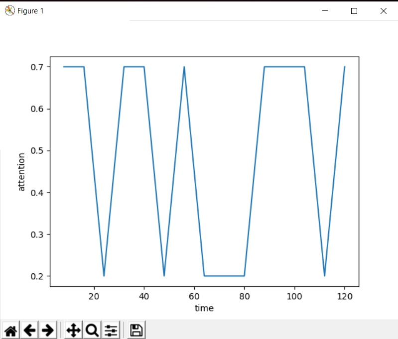

# lime
Attention Span Detection for Audio-Visual Content Analysis

## Description

Project for CodeBreak2019, MIT Pune.

[CodeBreak.ipynb](https://github.com/amurto/Lime/blob/master/train/CodeBreak.ipynb) is a Google Colab notebook for Emotion and Attention recognition.

This noteBook generates a csv file mapping each second to attention and emotion at that particular moment and generates a graph of Attention vs Time.

The frontend webapp is written in React with Node.js as backend for users and participants.

## Webapp Images

